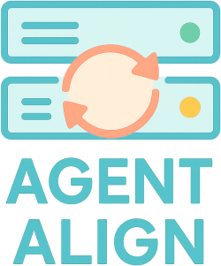

# Server Syncer



Server Syncer is a Go-based utility that keeps MCP configuration files aligned
across coding agents such as Copilot, Codex, Claude Code, Gemini, and others.
Choose a source agent, and Server Syncer reads that agent’s configuration file
to convert it into the formats required by each tool while treating one format
as the source of truth.

## Getting Started

1. Install Go 1.22 or newer.
2. Create a config (or update an existing one) by running the init command:

   ```bash
   go run ./cmd/server-syncer init -config ./server-syncer.yml
   ```

3. Run the CLI with that config so it can read the source agent and target list:

   ```bash
   go run ./cmd/server-syncer -config ./server-syncer.yml
   ```

4. The tool will echo the converted configurations for each agent so you can copy
them into the appropriate files.

## Configuration

Server Syncer looks for a YAML configuration at one of the platform-specific locations:

- **Linux**: `/etc/server-syncer.yml`
- **macOS**: `/usr/local/etc/server-syncer.yml`
- **Windows**: `C:\ProgramData\server-syncer\config.yml`

You can override this path with `-config <path>`. The file should describe the
`source` agent and the list of `targets`. Server Syncer automatically reads the
real configuration file for the source agent (for example, `~/.codex/config.toml`
when `source: codex`). See the [Configuration Guide](configuration.md) for the
schema and a sample layout.

## Testing

Run the following command to execute all tests:

```bash
go test ./...
```

## More Information

- [Configuration Guide](configuration.md) - Detailed configuration options
